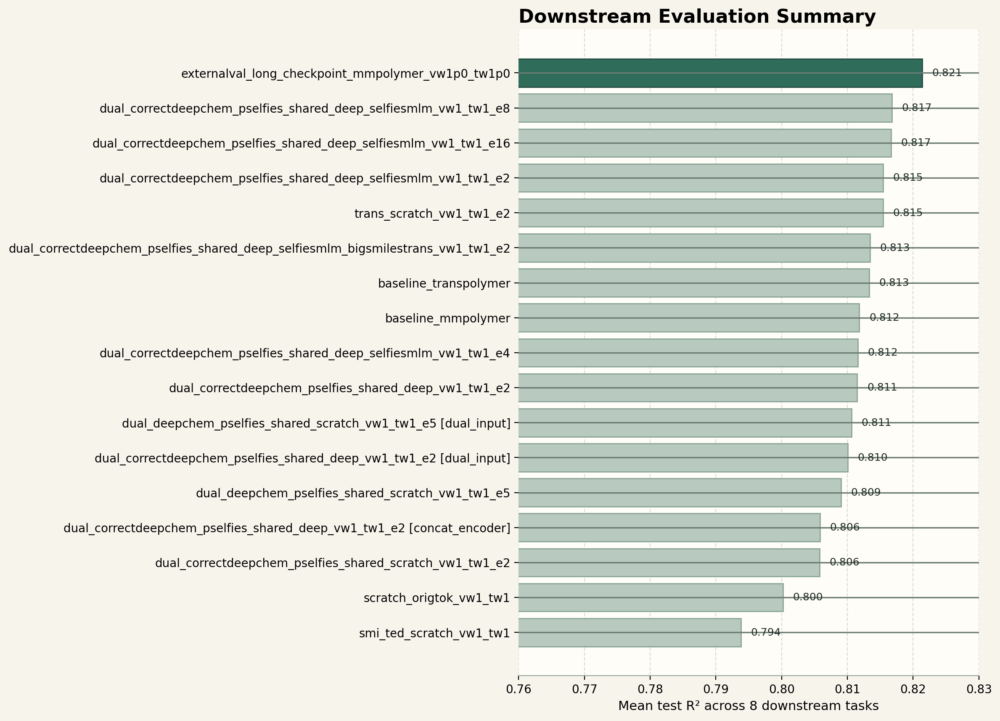

# PI1M Continued Pretraining Experiments

This workspace supports two protocols on PI1M:

- checkpoint continuation on PI1M with a deduplicated external validation mixture
- clean scratch training on a fixed canonical-hash train/val split

The default protocol is checkpoint continuation with external validation. This keeps the published pretrained initialization while avoiding validation polymers that may already be present in the released PI1M-based checkpoints.

Objectives:

- original masked-token continuation
- optional same-polymer view invariance
- optional masked `pSMILES <-> pSELFIES` translation

The pSELFIES path uses a deterministic At-terminated proxy conversion:

1. replace polymer termini `*` with `[At]`
2. RDKit-canonicalize the resulting pseudo-molecular SMILES
3. encode that canonical pseudo-molecule with `selfies`

This is lighter than the full polyBART cyclic canonicalization pipeline, but it gives stable paired supervision quickly for PI1M continuation experiments.

## Path configuration

The repo is intended to be portable across machines. The checked-in [`paths.txt`](paths.txt) now uses relative defaults, so if you keep sibling repos and datasets next to this checkout, it can run without editing absolute `/mnt/data/...` paths.

If your layout differs, edit `paths.txt` before running training or evaluation.

## Downstream evaluation snapshot

The repository has enough downstream evaluation outputs to summarize mean test-set R² across the 8-task comparable runs (`EPS`, `Eat`, `Eea`, `Egb`, `Egc`, `Ei`, `Nc`, `Xc`).



Regenerate the figure with:

```bash
python3 scripts/plot_downstream_mean_r2.py
```

## Run one checkpoint + external-val experiment

```bash
cd /path/to/p1m_pretrain_experiments
python3 scripts/train_one.py \
  --backbone transpolymer \
  --init-mode checkpoint \
  --validation-protocol external_polymer_mix_v1 \
  --run-name externalval_checkpoint_transpolymer_both \
  --view-weight 0.1 \
  --translation-weight 0.5
```

## Run the full checkpoint + external-val 8-run pilot grid

```bash
cd /path/to/p1m_pretrain_experiments
python3 scripts/run_grid.py
```

## Run the clean scratch fallback explicitly

```bash
cd /path/to/p1m_pretrain_experiments

Edit `paths.txt` before running training or evaluation if your local data, checkpoint, or cache roots differ from the defaults.
python3 scripts/train_one.py \
  --backbone transpolymer \
  --init-mode scratch \
  --validation-protocol canonical_proxy_hash_v1 \
  --run-name clean_scratch_transpolymer_both \
  --view-weight 0.1 \
  --translation-weight 0.5
```
